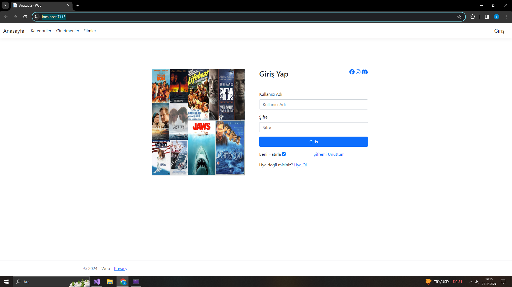
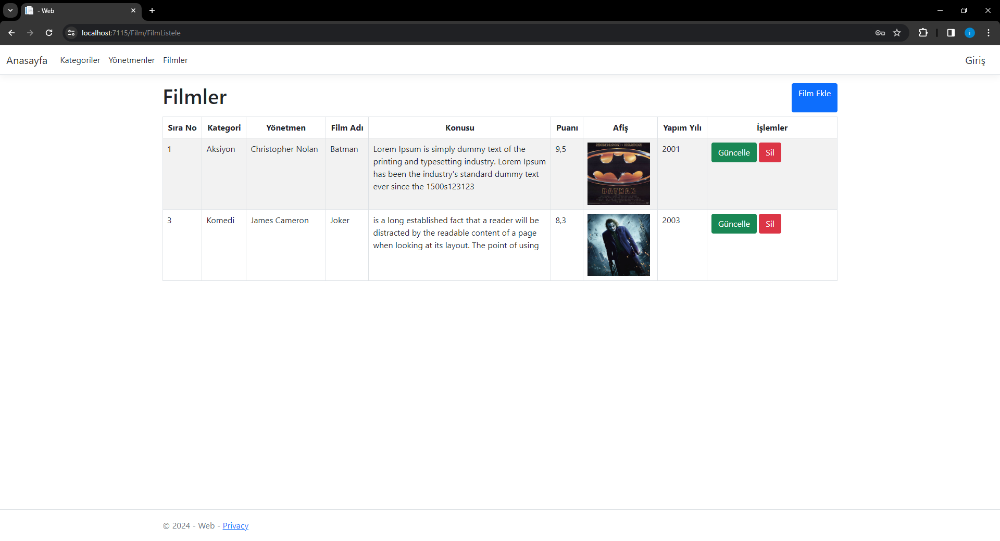

# Filmler
Bu uygulama ile kullancılara film tanıtımı amaçlanmıştır. Filmle ilgili kategori, yönetmen, oyuncu bilgileri yanı sra konusu ve puanları hakkında bilgi verilmektetir. 
Bu proje .net 6 ortamında ASP.Net Core MVC modeli ile yazılmıştır.
Boostrap kullanılmıştır.
# Kullanıcı Giriş
* Buradan Kullanıcı giriş yapılmıştır

 
*Kullanıcı girişi yapıldıktan sonra uygulama kullanıcıyı filmler sayfasına yönlendirir

* Hasta hesabına girdikten sonra bilgilerini düzenleyebilir.
* Geçmiş randevularını görebilir.
* Randevu isteği oluşturabilir.

* Hasta; branşı, doktoru ve uygun randevu saatini seçer.
* Şikayetini yazarak randevu oluşturur.

# Doktor Girişi
* Doktor Giriş Yapar.                                

* Doktor Kullanıcı Ekranından Randevulari görür ve şikayetlere bakar.

* Doktor Duyuruları görebilir.
* Bilgilerini Düzenleyebilir.

# Sekreter Girişi
* Sekreter Giriş Yapar.                                 

* Sekreter, Branşları ve Doktorları görebilir.
* Duyuru Oluşturabilir.
* Randevu Oluşturabilir.

* Doktor Ekle, sil ve güncelleyebilir.
* Brans Ekleyebilir.

* Randevu Listesini görebilir.

