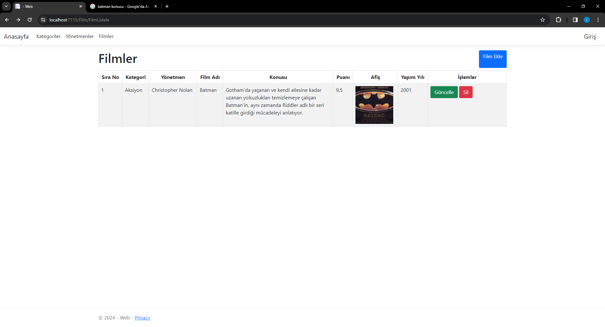

# Filmler
Bu uygulama ile kullancılara film tanıtımı amaçlanmıştır. Filmle ilgili kategori, yönetmen, oyuncu bilgileri yanı sra konusu ve puanları hakkında bilgi verilmektetir. 
Bu proje .net 6 ortamında ASP.Net Core MVC modeli ile yazılmıştır.
Boostrap kullanılmıştır.
# Kullanıcı Giriş
* Burada Kullanıcı giriş yapar. 

*Kullanıcı girişi yapıldıktan sonra uygulama kullanıcıyı filmler sayfasına yönlendirir.

 

# Filmler 
Buradan Kullanıcı:
* Film Ekleyebilir.
* 

* Filmleri Güncelleyebilir.
* 

* Filmleri Silebilir. 
* 

# Kategoriler
Burada Kategoriler düzenlenebilir
*

